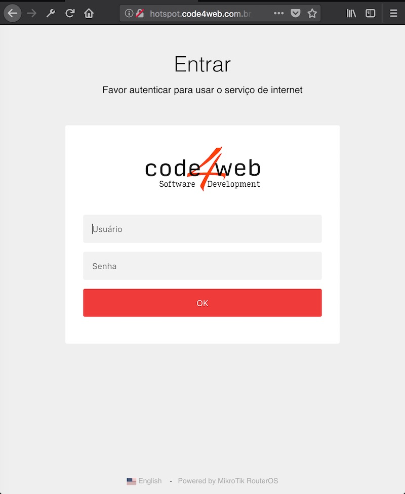
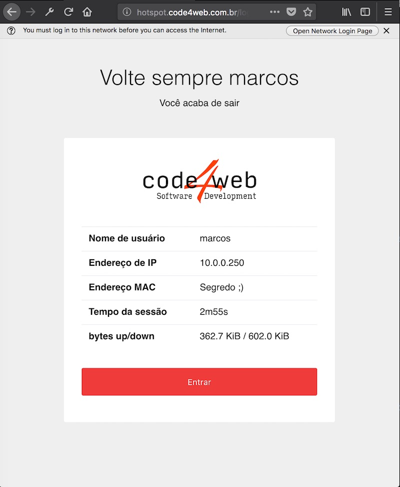
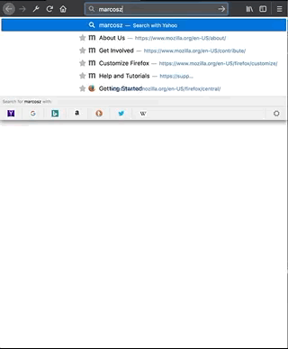

# Mikrotik Hotspot Template

Esse repositório contem um template mais agradável para ser usado em um hostpot do Mikrotik. Todas as funcionalidades e eventos foram mantidas da mesma forma que do projeto original que vem com firmware. Apenas foi feito um novo template responsivo e com código mais elegante.

## Sobre

Foi utilizado [Middleman](https://middlemanapp.com) como framework. Portanto caso não conheça basta visitar a [documentação](https://middlemanapp.com/basics/install/) e ver como funciona.

Mantive o Português como idioma principal. E como idioma secundário Inglês. Todas as views, configurações e notificações foram traduzidas. Caso necessite de mais idiomas basta utilizar a mesma estrutura de `source/en`.

```
└── source
    # Views referente Português
    ├── alogin.html.erb
    ├── error.html.erb
    ├── errors.txt
    ├── login.html.erb
    ├── logout.html.erb
    ├── radvert.html.erb
    ├── status.html.erb
    # Views referente Inglês
    ├── en
    │   ├── alogin.html.erb
    │   ├── error.html.erb
    │   ├── errors.txt
    │   ├── login.html.erb
    │   ├── logout.html.erb
    │   ├── radvert.html.erb
    │   └── status.html.erb
    # Adicione quantas mais for necessário para sua aplicação.
    (..)
```

## Como usar

```
# Instalar dependências
bundle install
# compilar site
bundle exec middleman build
# Ou para executar ele
bundle exec middleman server
# Hostspot não utiliza index file como padrão. Portanto acesso páginas diretamente: 127.0.0.1:4567/login.html
```

## Preview

Login


Status


Exemplo em funcionamento:

